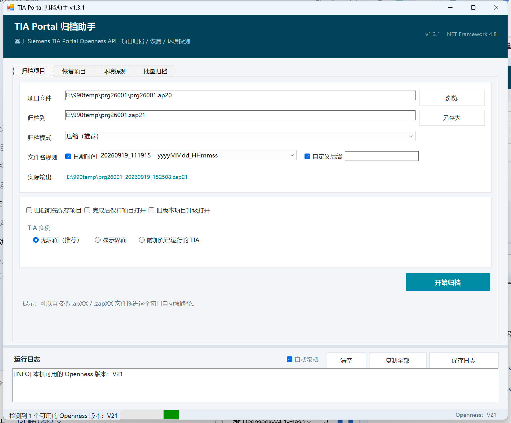
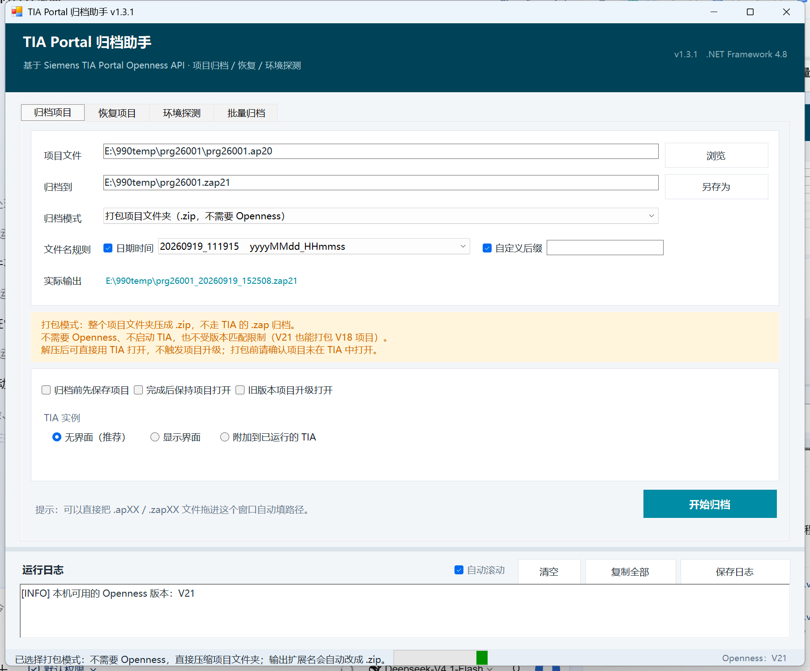
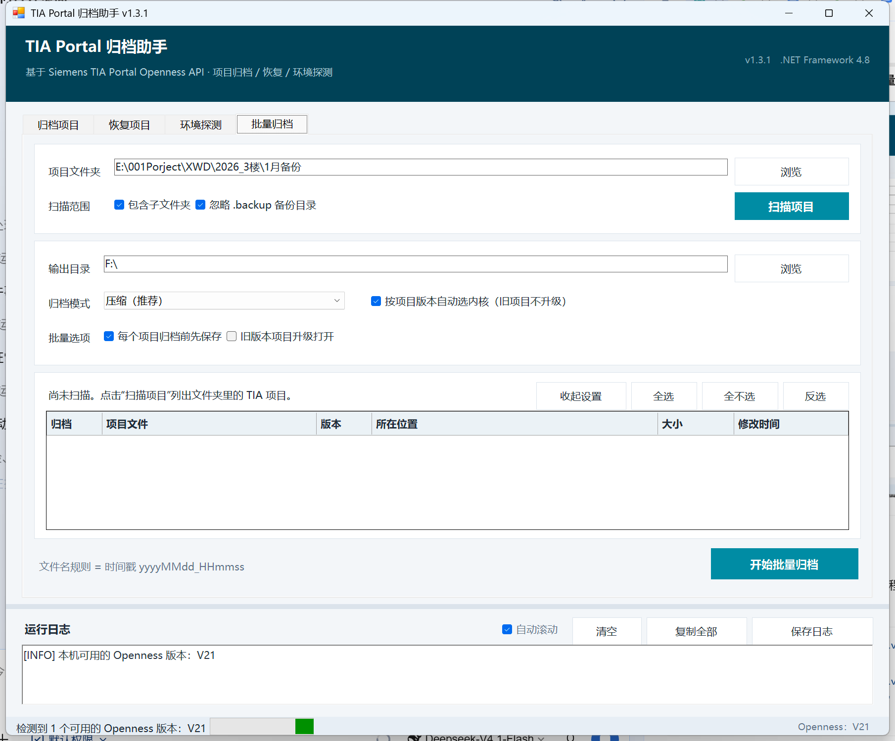
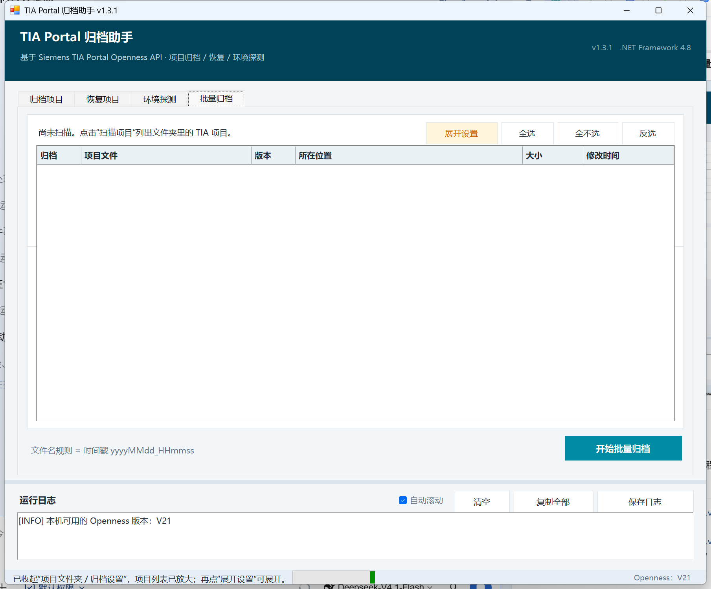
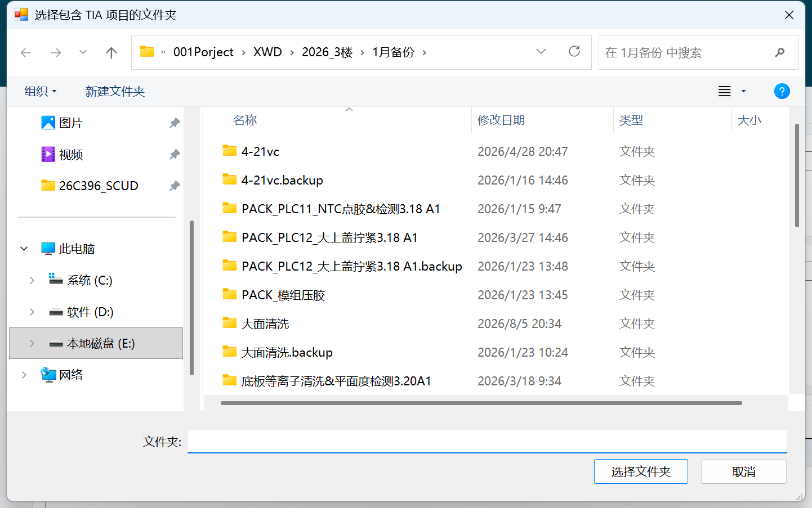

# TIA Portal 归档助手（图形界面版）

`TiaArchiveGui` —— 用鼠标点选即可完成 **项目归档 / 恢复 / Openness 环境探测 / 批量归档 / 打包项目文件夹**，
不需要记命令行参数。核心逻辑来自共享内核 `..\TiaOpennessKit\`。



---

## 1. 与共享内核的关系（重要）

界面版**不是**另写一套逻辑，而是通过工程文件里的链接引用，直接编译共享内核
`..\TiaOpennessKit\` 里那批已经过验证的核心源码：

```xml
<Compile Include="..\TiaOpennessKit\Tia\TiaEnvironment.cs" Link="Core\Tia\TiaEnvironment.cs" />
<Compile Include="..\TiaOpennessKit\Services\ArchiveService.cs" Link="Core\Services\ArchiveService.cs" />
... 共 15 个文件
```

好处很实在：归档/检索/探测/网络设备读取只有**一份**实现，改一处所有工具同时生效，
永远不会出现"命令行能归档、界面版不行"这类诡异问题。

> 历史变更（2026-09-20）：原先链接的是同目录下的命令行版工程 `OpennessArchiveTool`；
> 命令行版已停止维护并移入 `..\归档\`，源码统一收进 `..\TiaOpennessKit\`（唯一真源）。
> 界面层的主题、日志转发、现代文件夹对话框、前置体检、项目扫描器也都在内核里了。

界面层自己只负责三件事，全部集中在 `MainForm.cs` / `MainForm.Actions.cs`：
收集输入 → 丢到后台线程执行 → 把日志显示出来。

```
TiaArchiveGui/
├── TiaArchiveGui.csproj     工程文件（net48 / WinExe / Siemens 引用 Private=false）
├── app.manifest             ★ DPI 感知清单（被编译进 exe 内部 → 发布只需 exe 一个文件）
├── Program.cs               入口（正常开窗 / --selftest / --uicheck 三种模式）
├── MainForm.cs              窗口骨架、页签布局、控件工厂
├── MainForm.Actions.cs      单文件归档/恢复/探测的事件、后台线程编排、界面自检、截图
├── MainForm.Batch.cs        批量归档页：扫描、勾选列表、批量执行与进度
├── CoreRunner.cs            真正发起归档/恢复/探测的地方（只编排，不含 Siemens 类型）
├── BatchChildJob.cs         子进程按版本换内核时的任务文件
├── ..\TiaOpennessKit\       共享内核（唯一真源）：
│     ├── ExitCodes.cs / Logging.cs / ArchiveNaming.cs / FolderPackager.cs / BatchScanner.cs
│     ├── EnvironmentChecks.cs   前置条件体检 + 一键修复脚本生成
│     ├── UiTheme.cs / UiLogSink.cs / ModernFolderDialog.cs   界面层可复用件
│     ├── Tia\TiaEnvironment.cs  多版本环境探测 + 程序集解析钩子
│     ├── Tia\OpennessApi.cs     ★ 运行期绑定 Openness（编译期不引用 Siemens 程序集 → 一份 exe 通吃 V16~V21）
│     ├── Tia\TiaSession.cs      会话生命周期（附加模式不会关用户的项目）
│     ├── Tia\TiaDeviceInventory.cs / TiaRunningInstance.cs   读网络设备（TiaDeviceGui 用）
│     └── Services\ArchiveService.cs / ApiProbe.cs / DeviceInventoryExporter.cs
├── UiTheme.cs → 已移入内核    配色与字体集中定义
├── GuiSettings.cs           记住上次用过的路径与选项
├── 发布/                     拷到别的电脑用的那一个 exe（见 2.1 节）
├── screenshots/             界面截图
```

> `发布/` 里只有 `TiaArchiveGui.exe` 一个文件，是 `bin\Release` 的副本，专门用来拷 U 盘。
> **重新编译后要重新拷一次**，否则它会停在旧版本。

---

## 2. 编译与运行

```bat
cd TiaArchiveGui
dotnet build TiaArchiveGui.csproj                 :: 或直接用 Visual Studio 打开生成
bin\Debug\TiaArchiveGui.exe                       :: 日常调试用这个

dotnet build TiaArchiveGui.csproj -c Release      :: 要拷到别的电脑去用，编 Release
bin\Release\TiaArchiveGui.exe                     :: 更小（164 KB vs 176 KB）且无调试开销
```

如果 TIA 装在非常规位置，编译时显式指定 API 目录：

```bat
dotnet build TiaArchiveGui.csproj "/p:TiaPublicApiDir=E:\Program Files\Siemens\Automation\Portal V21\PublicAPI\V21\net48\"
```

**运行时不会**把 `Siemens.Engineering*.dll` 复制到输出目录（`<Private>false</Private>`），
程序在启动时通过 `AssemblyResolve` 从 TIA 安装目录按需加载。

**DPI 感知声明编译在 exe 内部**（`app.manifest`，见 2.1 节），所以产物里不需要
`.exe.config` —— 这也意味着发布就是"拷一个 exe"这么简单。

### 2.1 拷到别的电脑上用（要拷哪些文件）

**只要拷一个文件**：

```
TiaArchiveGui.exe          程序本体（约 164 KB，单文件）
                           没有第三方 DLL，也没有外部配置 —— DPI 感知在 exe 内部
```

`TiaArchiveGui.pdb`（调试符号）不用拷，`.exe.config` 也不再有。

> 之前版本要靠 `TiaArchiveGui.exe.config` 里的 `DpiAwareness` 声明 DPI 感知，
> 丢了那个文件程序在 125%~200% 的屏幕上会被系统整体拉伸（发虚）；现在改成把
> `app.manifest` 编译进 exe（`<ApplicationManifest>`），这个依赖已经没有了。
> 万一将来某次构建把清单弄丢了，特征很好认：`--uicheck` 会打印 `屏幕 96 DPI（100%）`
> 而不是屏幕的真实 DPI。

**目标机器还需要什么，取决于你要用哪种模式**：

| 你要做的事 | 目标机器需要 | 说明 |
| --- | --- | --- |
| 打包项目文件夹（.zip） | 只要 .NET Framework 4.8 | **完全不需要 TIA / Openness**：这条路径不加载任何 Siemens DLL、不启动 TIA |
| 归档 / 恢复 / 环境探测（.zapXX） | .NET Framework 4.8 **+ TIA Portal（带 Openness 组件、主版本与项目一致）+ 当前用户已在 `Siemens TIA Openness` 本地组** | Openness 组件不在工具里，来自 TIA 安装介质（见第 4.1 节） |

- **.NET Framework 4.8**：Windows 10 1903 及以后 / Windows 11 自带；
  Win7 / Win8.1 / 早期 Win10 需要先装（微软官网免费）
- 只要是"**只想压个包备份**"的场景，目标机器什么都不用装 —— 这也是打包模式存在的意义

**到新机器后先跑一次体检**（不开窗、不启动 TIA，退出码 0 = 全通过）：

```bat
TiaArchiveGui.exe --envcheck "%TEMP%\envcheck.log"
```

它会逐项报告：Openness 组件 / 用户组 / .NET 版本 / TIA 本体 / 权限与首次授权须知。
缺什么、怎么补，日志里直接写着。

> **TIA 装在非默认目录也不用管它。** 程序会自动从注册表登记路径、常见安装位置、
> 以及各盘的浅层扫描里去找（详见第 4.1 节"TIA 装在非默认目录怎么办"）。
> 万一那台机器连注册表里都没有记录，把 API 目录手工指给它就行：
> ```bat
> TiaArchiveGui.exe --envcheck "%TEMP%\envcheck.log" "D:\V19\Portal V18\PublicAPI\V18"
> ```
> 第三个参数是可选的 —— 体检会把它也当作"组件可用"的依据，不会因为自动定位没找到就报红叉。

**工具"记住"的东西**（不需要跟着拷）：上次用过的路径与选项存在
`%APPDATA%\TiaArchiveGui\settings.txt`，到新机器上重新选一次即可。

---

## 3. 四个页签怎么用

### 归档项目

| 控件 | 说明 |
| --- | --- |
| 项目文件 | 要归档的 `.apXX`；可以直接把文件**拖进窗口**自动填 |
| 归档到 | 输出的 `.zapXX`；选完项目文件后自动建议**项目目录的上一级**同名路径 —— **别放进项目目录里（含子目录）**，TIA 会拒绝（见下方"归档产物不能落在项目目录里"） |
| 归档模式 | 见下表，**建议一律用"压缩"**；另有"打包项目文件夹"，见 3.2 节 |
| 归档前先保存项目 | 推荐勾选。项目有未保存修改时归档可能失败 |
| 完成后保持项目打开 | 不勾选则归档完就关闭项目 |
| 旧版本项目升级打开 | **归档 `.ap18`/`.ap19` 等老项目时必须勾选**（走 `OpenWithUpgrade`）。勾选后会弹确认框，因为项目会被升级到本机 TIA 版本且不可回退 |
| 文件名规则 | 自定义后缀 + 日期时间戳，见下面第 3.1 节 |
| TIA 实例 | 无界面（推荐）／显示界面（想看 TIA 在做什么）／附加到已运行实例 |

### 换项目时"归档到"会跟着走（防覆盖历史归档）

用"浏览"换了项目、或从外面拖一个项目进来时，**"归档到"会自动跟着更新**：

- 你没自己选过输出位置 → 整个跟着项目走：**项目目录的上一级** + 项目名 + 当前内核扩展名
- 你**自己选过**（例如固定在 `D://Bak` 归档）→ **保留你选的目录**，只把文件名换成新项目的名字

> 为什么专门做这个：以前"归档到"只在为空时才自动填，于是**换了新项目、输出还是上一个项目的名字**，
> 第二次归档就把第一次的产物覆盖了（虽然有同名确认框，但很容易顺手点"覆盖"）。
> 现在同一目录里归档多个项目不会互相覆盖；万一真撞上同名，确认框里还会提醒"这个名字与当前项目不一致"。

### 归档页的版本提示（项目版本 vs 内核版本）

在归档页选好项目后，**状态栏**会直接告诉你这一单会怎么走：

| 情况 | 状态栏说什么 |
| --- | --- |
| 项目与内核同版本 | 可直接归档；产物为 `.zap21`（跟着内核） |
| 项目比内核旧 | 必须勾"旧版本项目升级打开"，产物是 `.zap21`；**想保留原版本就切内核** |
| 项目比内核新 | ⚠ 当前内核打不开它，请把"可用版本"切到该项目版本 |

"实际输出"那一行的文件名也会在版本不一致时**加 ⚠ 前缀并变色**（橙=要升级、红=打不开）。

> **为什么 `.ap20` 项目建议的名字是 `.zap21`？** 因为**归档格式由内核决定，不由项目决定** ——
> 用 V21 内核归档，产物就是 V21 格式，名字也跟着是 `.zap21`。
> 想拿到 `.zap20`，就得把"可用版本"切到 V20 再生效（那样也不升级）。

**"旧版本项目升级打开"会告诉你升到哪个版本**：复选框文字直接带目标版本
（`旧版本项目升级打开（→ V21）`，跟着"可用版本"走），悬停提示里写清三件事 ——
只升级**内存**（不勾"先保存"就不动磁盘）、**产物是内核格式 `.zap21`**、想保留原版本就把"可用版本"切到该项目版本。

**另外：注定失败的组合不会再去启动 TIA。** 项目比内核新、或者项目比内核旧且本机没有那个版本的
Openness 又没勾"升级打开"，这两种情况会在启动前**当场拦下**并给出两条出路 ——
实测拦住时只花 0.1 秒（不然要白等 TIA 冷启动几十秒）。

**归档产物不能落在项目目录里（含子目录）。** TIA 的归档会拒绝这种组合，报
`Unable to archive the project. / Archiving failed. / 项目目录已存在，无法保存。请选择一个不同的路径。`

实测矩阵（同一个项目、同一个无界面实例）：

| 归档输出位置 | 结果 |
| --- | --- |
| 项目自身目录 | ❌ 失败（V19 用户机、V21 本机均复现） |
| 项目目录的子目录（如 `项目\bak\`） | ❌ 失败（V21 实测，同样报"项目目录已存在"） |
| **项目目录的上一级** | ✅ **成功**（V21 实测，产物正常生成） |
| 批量归档另选输出目录 | ✅ 成功（用户实测） |

与版本 / 权限 / 授权 / 项目本身都无关。所以"归档到"的默认建议值是**项目目录的上一级**；
如果你手动把它改回项目目录里，工具会在启动 TIA 之前**拦下并提示**（与上面那两种组合一样，不会白等几十秒冷启动）。

**另一条实测（V21）：TIA 的归档不覆盖已存在的目标。** 第二次归档到同一个文件名会报
`Archive Operation is not possible as the target file/folder '…' is already exist.` ——
所以界面上选"覆盖"时，工具的做法是：先把旧文件改名成 `.old` 备份 → 归档成功后才删除备份 →
失败则把旧文件恢复回来（不会出现"旧备份没了、新归档也没成"的窗口）。
没有选择"覆盖"（例如批量子进程、或目标在确认前才出现）时，工具会在启动 TIA 之前就把"目标已存在"拦下。

### 3.1 文件名规则：自定义后缀 + 日期时间戳

TIA GUI 的归档对话框里有个"将日期和时间添加到目标名称中"。**Openness 没有这个参数** ——
`Project.Archive(DirectoryInfo targetDirectory, string targetName, ProjectArchivationMode mode)`
三个参数里没有它；TIA 自己也是界面层把名字拼好再调底层的。所以本工具在调用前自己拼，
效果与 TIA 一致：

| 情况 | 结果 |
| --- | --- |
| 原样 | `Demo_V21.zap21` |
| 只加后缀 `backup` | `Demo_V21_backup.zap21` |
| 只加日期时间 | `Demo_V21_20260919_111915.zap21` |
| 两个都加 | `Demo_V21_backup_20260919_111915.zap21` |

| 特性 | 说明 |
| --- | --- |
| **实时预览** | 填好路径立刻在"实际输出"里看到最终文件名，不用归档完再去目录里找 |
| **拼接顺序** | 固定为 项目名 → 后缀 → 时间戳（这样同一后缀的备份会排在一起） |
| **时间戳格式** | 下拉可选，左边显示示例、右边是 .NET 格式串，默认 `yyyyMMdd_HHmmss` |
| **后缀规范化** | 填 `bak` 自动补成 `_bak`；填 `_bak` 用原样；非法字符 `\ / : * ? " < > \|` 自动过滤 |
| **同名处理** | 目标已存在时问你：**【是】**覆盖／**【否】**自动加序号（`Demo(2).zap21`）／**【取消】**返回。**覆盖是我方实现的**：TIA 的归档不覆盖已存在的目标（实测报 `… is already exist.`），所以选【是】时工具会先把旧文件改名成 `.old` 备份 → 归档成功后才删备份 → 失败则把旧文件恢复回来 |
| **批量归档** | 整批共用**同一个时间戳**（一眼看出是同一批备份）；冲突一次问清（全部覆盖／全部加序号） |
| **规则共用** | 批量页不重复放一套控件，直接沿用归档页的设置，页面底部会显示当前规则，例如<br>`文件名规则 = 后缀 _bak + 时间戳 yyyyMMdd_HHmmss`（时间戳显示的是**格式串**而不是具体时刻，因为规则本身不随时间变） |

> 扩展名绝不会被改动 —— 归档产物的扩展名由 TIA 按当前主版本决定，规则只动主名。
>
> 想增减可选的时间戳格式，改 `..\TiaOpennessKit\ArchiveNaming.cs` 里的
> `TimestampPresets` 数组即可（格式串就是 .NET 标准日期格式）。
> 网络设备工具（TiaDeviceGui）的导出文件名也用同一套规则。

### 3.2 打包项目文件夹（.zip）—— 不需要 Openness，也不受版本限制

这是归档模式里的第 5 项。它**根本不是 TIA 归档**，而是把整个项目文件夹压成 .zip：

| | TIA 归档（.zapXX） | 打包项目文件夹（.zip） |
| --- | --- | --- |
| 需要 Openness 组件 | ✅ | ❌ **完全不需要** |
| 需要启动 TIA | ✅（几十秒） | ❌ **不需要**（秒级） |
| 版本限制 | 必须版本匹配 | ❌ **完全无关**：用 V21 环境打包 V18 项目 → 解压后仍是 V18，拿 V18 的 TIA 打开不会触发升级 |
| 产物体积 | 小（会丢弃可恢复数据） | 大（完整快照，约原大小的 80%~100%） |
| TIA 里怎么用 | 先"恢复/解压"再打开 | **解压出来直接打开** |
| 扩展名 | `.zap21` | `.zip` |

**关键实现点**：打包的是**整个项目文件夹**（含 `System` / `IM` / `XRef` / `AdditionalFiles` 等全部子目录，
空目录也会保留），不是只有那一百多 KB 的 `.apXX` —— 光打包那个文件解压出来是打不开的。
包内保留一层项目目录名，解压后得到 `项目名\项目名.apXX`，符合 TIA 的目录习惯。

**实测数据**（本机一个真实的 V20 项目，含 230MB 的 System 目录）：

```
62 个文件，229.89 MB → 191.66 MB（压缩后 83.4%），耗时 5.3 秒
解压后逐文件比对：文件数一致、字节数零差异、目录结构完整
```

**什么时候用它**：
- 机器上**没有 Openness**（或不想装）
- 项目版本与本机 TIA 不匹配，**又不想升级项目**
- 只想快速留一份完整备份
- 批量备份一堆项目 —— 这个模式下批量会非常快

**注意事项**：
- 打包前请**关闭 TIA 里打开的该项目**；被占用的文件会被跳过，日志里会逐个列出来
- 压缩率不如 TIA 归档：TIA 会把搜索索引等"可恢复数据"丢掉，zip 是完整快照
- 命令行版同样支持：`--mode pack`



> **界面上那条黄色的提示**就是这个模式的说明条，三行字分别是：
> ① 它压的是 .zip，不是 TIA 的 .zap 归档；② 不需要 Openness、不启动 TIA、不受版本限制；
> ③ 解压后能直接用 TIA 打开、不触发升级，打包前要确认项目没在 TIA 里开着。
> 它只在这个模式下出现，切回"压缩（推荐）"就收起来，不占界面高度。

> 输出到项目文件夹内部时，程序会自动把压缩包自己排除在打包范围外（并提示你换个位置更干净）。

| 归档模式 | 说明 |
| --- | --- |
| 压缩（推荐） | `ProjectArchivationMode.Compressed` |
| 不压缩 | 类似"另存为"，不生成压缩包 |
| ⚠ 丢弃可恢复数据 | **不可逆**，会丢掉下载/在线比较所需的符号信息 |
| ⚠ 丢弃可恢复数据并压缩 | 同上，且压缩 |
| 打包项目文件夹（.zip） | **不经过 Openness**，直接把整个项目目录压成 .zip，见 3.2 节 |

> 选中后两项时，界面会弹出红色警告条，点"开始归档"还会再确认一次 ——
> 因为这个操作一旦落盘就找不回来了。

### 恢复项目

选归档文件 → 选解包目录 → 开始恢复。
"归档来自更早版本时升级后打开"对应 Openness 的 `RetrieveWithUpgrade`。
目标目录非空时会提醒一次（里面有同名项目会导致解包失败）。

### 环境探测

**建议第一次使用就先点这个。** 它只读不写：不启动 TIA Portal，只探测
Openness 装在哪个版本、API 目录在哪、反射打印本机真实的 API 签名，
顺带检查当前 Windows 用户是否在 `Siemens TIA Openness` 组里。

### 前置条件体检（点一下就知道差什么）

点"环境探测"页的 **检查前置条件**，逐项给出结论与修复办法：

| 检查项 | 说明 |
| --- | --- |
| Openness API 组件 | 找出所有装了 Openness 的版本，列出各自的 API 目录 |
| Openness 用户组 | 组是否存在、当前有哪些成员 |
| **当前用户权限生效** | 最关键的一项：**当前登录会话**是否真的具备权限 |
| TIA Portal 本体 | 各版本的 `Siemens.Automation.Portal.exe` 是否存在 |
| .NET Framework 版本 | 读注册表拿真实版本（`Environment.Version` 只会返回 4.0.30319，看不出装的到底是 4.6.2 还是 4.8） |
| 管理员权限 | 须知项：归档**不需要**管理员权限 |
| 首次连接授权 | 须知项：首次连接会弹授权窗口，选"允许" |

**它不只会提示，还会帮你把活干了：**

- 发现"当前用户不在组里" → **自动尝试帮你加入**（当前进程有管理员权限时直接成功）
- 加不了（没提权）→ 自动生成 **`修复前置条件.cmd`**，右键"以管理员身份运行"即可
- 脚本内容完全透明（用记事本就能看），不做偷偷提权的事

⚠️ **最容易踩的一条：Windows 本地组的变更必须"注销并重新登录"才生效。**
体检会刻意区分两种情况，因为它们要做的操作完全不同：

| 体检说什么 | 什么意思 | 该做什么 |
| --- | --- | --- |
| 当前用户 **不在** 组中 | 组员名单里确实没有你 | 加组 → 注销重新登录 |
| 你**在**组员名单里，但当前会话未生效 | 加过了，只是没重新登录 | **只需注销重新登录**（再加组没用） |

第二句话能省掉大量"我明明加进组了，怎么还报权限错误"的困惑。

不想开窗口也能体检：

```bat
TiaArchiveGui.exe --envcheck "E:\temp\env.log"
```

### 批量归档

适合"这个文件夹里的项目我都要备份"的场景：

```
① 项目文件夹 → 浏览，选中存放项目的文件夹（如 E:\WorkBuddySpace\TIAv21\）
   勾选"包含子文件夹"（TIA 一般是一个项目一个同名文件夹，不递归找不到）
② 点"扫描项目"
   → 列表列出所有 .apXX（项目名 / 所在位置 / 大小 / 修改时间），默认全部勾选
③ 用"全选 / 全不选 / 反选"，或直接点每行的复选框，只留要归档的
④ 输出目录 → 浏览，选归档文件存放位置（每个项目生成一个同名的 .zap21）
⑤ 选归档模式与选项（每个项目归档前先保存 / 旧版本项目升级打开）
⑥ 点"开始批量归档" → 汇总确认 → 开始
```



**混版本批量归档（V16 / V19 混在一起）**：扫描后在列表的**版本**列能看到每个项目的版本，并且
按与当前内核的关系着色 —— 🟢 同版本（可直接归档）、🟠 较旧（需勾"升级打开"，否则打不开）、
🔴 比内核新（当前内核打不开，得换内核）。鼠标停在版本上会给出该项目的具体处理建议。

点"开始批量归档"时还会先做一次**版本体检**：有比内核新的项目直接拦下并提示换内核；
有较旧的项目会问你要不要帮勾上"旧版本项目升级打开"（不勾就会打开失败）。

批量页有两个内核相关的勾选，它们是**两条互斥的路**（勾一个会自动取消另一个，并说明为什么）：

| 勾选 | 旧版本项目怎么处理 | 产物 |
| --- | --- | --- |
| **按项目版本自动选内核**（默认） | 用它**自己的版本**起子进程原生归档，**不升级** | `.zap16`（保持原版本） |
| **旧版本项目升级打开** | 统统用当前内核**升级打开** | `.zap19` / `.zap21`（内核版本） |

> 以前两个能同时勾，但"升级打开"会被**静默忽略**（自动选内核优先），容易让人以为勾了升级就生效了。
> 现在改成互斥 + 状态栏当场说明；而且开始归档前的**汇总确认框**会逐项列出每个项目"用哪个内核、
> 会不会升级"，一眼看清这一批到底会怎么走。

批量页的"归档模式"那一行还有个 **「按项目版本自动选内核（旧项目不升级）」** 开关（默认勾选）：
打开后，版本与当前内核不同的项目会**按版本分组、各起一个子进程**，子进程绑定与本机匹配的
Openness 版本去**原生打开**（不升级），于是 `.ap16` 归档出来就是 `.zap16`，不会被升级成 V19/V21。
前提是本机装了那个版本的 TIA + Openness（用户那台机器 V15~V19 都装了，所以可用）；
每个版本要各自启动一次 TIA（几十秒），同版本的项目共用一个子进程。

**项目多的时候点右上角的「收起设置」** —— 把上面"项目文件夹 / 归档设置"两张卡片收起来，
高度全给项目列表。实测（默认窗口尺寸、175% 缩放）：列表高度 **439px → 703px，多出 6 行**；
按钮会变成「展开设置」，设置项都还在，点一下原样回来。



几个值得知道的设计点：

- **只启动一次 TIA Portal**，然后循环处理所有项目。如果每个项目都新建一次实例，
  光是 TIA 冷启动就要几十秒 × N，10 个项目能等到怀疑人生
- **单个项目失败不会中断整批**：记录下来继续跑，最后在日志里统一列出哪些失败、失败原因
- **可中止**：运行时出现"中止剩余"按钮。点了之后当前项目会跑完，之后不再处理后续项目
  （Openness 调用本身没办法强行中断，所以做不到立刻停）
- **列表还能再大**：拖动中间那条分隔条可以把页签区整体拉高（日志区相应变小）；
  把窗口拉高 / 最大化同样有效
- **"浏览"用的是现代文件夹选择框**（能粘贴路径、有地址栏和左侧导航，与归档页观感一致），
  不是 .NET Framework 自带的那个老式树状对话框：

  

- 批量归档的 TIA 实例方式沿用"归档项目"页的选择，界面上的提示也是这么写的

---

## 4. 首次使用的正确顺序

```text
① 环境探测页 → 开始探测
   ├─ 看日志确认探测到的 Portal 版本与 API 目录
   └─ 看是否有"当前用户不在本地组 Siemens TIA Openness 中"的警告

② 归档页 → 用【项目副本】试一次
   ├─ 归档前先保存项目 ✓
   ├─ 模式选"压缩"
   └─ 首次会弹出 Openness 连接授权窗口 → 选"允许"

③ 熟练后再考虑：显示界面模式、附加到已运行实例
```

> **`--attach`（附加到已运行实例）默认不会关闭你的项目** —— 因为那个 TIA 实例是你自己在用的，
> 工具不会替你把它正在编辑的项目关掉。界面上的"完成后保持项目打开"就是控制这一点的。

---

## 4.1 版本兼容性（能不能归档旧版本项目？）

**工具是版本无关的**：探测逻辑覆盖 V15~V21 的目录布局差异（V21 多一层 `net48`、老版本只有
`Siemens.Engineering.dll`），拿到装了 V19 Openness 的机器上会自动探测到 V19，**同一份 exe 不用改也不用重编**
（详见下面那节"一份 exe 通吃 V15~V21"）。

**但 Openness 有一条硬规矩**：API 主版本必须与 TIA Portal 主版本一致。所以实际能用哪个版本，
取决于**本机装了哪个版本的 Openness 组件**。

| 目标 | 能否做到 | 做法 |
| --- | --- | --- |
| 用 V21 归档 `.ap18`/`.ap19` 老项目 | ✅ 可以 | 勾选"旧版本项目升级打开" |
| 归档产物保持旧格式（`.zap19`） | ❌ 不行 | 归档版本 = 运行内核版本，无法指定 |
| 用 V19 内核归档 | ✅ 可以 | V19 装了 Openness 组件即可；工具会自动挑本机版本，也能在"环境探测"页手动选 |

> **归档产物的扩展名 = 归档时用的那个内核的版本**，不是项目自己的版本：
> 用 V19 内核归档 → `.zap19`；用 V21 内核打开 `.ap19` 项目再归档 → `.zap21`（内容就是 V21 格式）。
> 这一条以前写死成 `.zap21`，在 V19 机器上会产出"名字叫 .zap21、内容其实是 V19"的文件（见第 7 节坑 13）。

⚠️ **升级不可逆**：勾了"升级打开"且同时勾了"归档前先保存项目"时，原项目文件会被升级后的
版本覆盖，旧版 TIA 再也打不开。**请用项目副本**。勾选时程序会弹确认框再问一次。

### 一份 exe 通吃 V15~V21（2026-09-19 已实现）

结论先说：**现在拿同一个 exe，插到装了 V16 / V17 / V18 / V19 / V21 的机器上都能用**，
不用再按机器版本各编一份。

#### 为什么以前做不到（这是本项目最重要的一条经验）

程序在**编译时**如果引用了某个 Openness 类型，那个"程序集名字 + 版本号"就被写进了 exe 的引用表，
运行时 CLR **只认那一个**。而 Openness 各版本之间：

| | 主程序集文件名 | 里面是 |
| --- | --- | --- |
| **V20 / V21** | `Siemens.Engineering.Base.dll`（外加 .Step7 / .WinCC 等模块） | 拆成了多个模块程序集 |
| **V15 ~ V19** | `Siemens.Engineering.dll`（外加 `Siemens.Engineering.Hmi.dll`） | 整个 API 都在这一个文件里 |

命名空间和类型名**完全一样**（都是 `Siemens.Engineering.Project`、`TiaPortal`…），
**变的只是"装在哪个文件里"** —— 连"绑定重定向"都救不了（重定向只能改版本号，不能改程序集名）。

实测踩到的现场（一台只有 V19 的机器上运行按 V21 编译的 exe）：

| 步骤 | 结果 |
| --- | --- |
| 环境探测 / 前置条件体检 | ✅ 全部通过 —— 它只读文件、用反射看签名，**不依赖编译期类型** |
| 把"API 目录"填成 V19 的路径 | ✅ 探测也认，界面上看起来一切正常 |
| 真正开始归档 | ❌ `未能加载文件或程序集"Siemens.Engineering.Base, Version=21.0.0.0"` |

**教训：API 目录只是"去哪儿找"，程序集标识是"只要哪一个"。** 两者都得对得上。

#### 现在是怎么做的

**编译期一个 Siemens 类型都不写**，改成运行期"按类型名去问"：

- 新增 `Tia\OpennessApi.cs`：从本机 API 目录加载程序集（自动识别是
  `Siemens.Engineering.dll` 还是 `Siemens.Engineering.Base.dll`），再按类型名解析出
  `TiaPortal` / `Project` / `ProjectArchivationMode` 等，所有调用走反射。
- `TiaSession` 里的 portal / project 一律是 `object`；`ArchiveService` 不再引用 Siemens 类型，
  归档模式换成工具自己的 `ArchiveMode` 枚举，调用时按**成员名**翻译成目标版本的真实枚举。
- 两个 `.csproj` 里的 Siemens 引用**全部删掉** —— 顺带的好处：**编译前不再需要本机装有 TIA**，
  在任何机器上 `dotnet build` 都能过。

验证方式（同一份 exe，逐个版本验）—— 现在有**一条命令全验完**的版本：

```text
--apimatrix <日志> <含 V16..V21 的根目录>   → 一张表看完 V16~V21，见下
```

实测输出（本机：只装了 V21，V16~V20 的 PublicAPI 是手工收集来的）：

```text
版本目录              假定的 Openness 程序集                结果
------------------------------------------------------------------------------
V16                   Siemens.Engineering 16.0.0.0          可以驱动 ✓
V17                   Siemens.Engineering 17.0.0.0          可以驱动 ✓
V18                   Siemens.Engineering 18.0.0.0          可以驱动 ✓
V19                   Siemens.Engineering 19.0.0.0          可以驱动 ✓
V20                   Siemens.Engineering 20.0.0.0          可以驱动 ✓
(本机自动探测)        Siemens.Engineering.Base 21.0.0.0     可以驱动 ✓
------------------------------------------------------------------------------
共 6 个版本，通过 6 个。
[ OK ] APIMATRIX_OK
```

也仍然可以单版本验（`TiaArchiveGui.exe --apiprobe <日志> <API目录>`）：

```text
--apiprobe <日志> <V16 目录>  → 可以驱动该版本：Siemens.Engineering 16.0.0.0 …类型与成员齐全
--apiprobe <日志> <V17 目录>  → Siemens.Engineering 17.0.0.0 ✓
--apiprobe <日志> <V18 目录>  → Siemens.Engineering 18.0.0.0 ✓
--apiprobe <日志> <V19 目录>  → Siemens.Engineering 19.0.0.0 ✓
--apiprobe <日志> <V20 目录>  → Siemens.Engineering 20.0.0.0 ✓
--apiprobe <日志>（不带目录）  → Siemens.Engineering.Base 21.0.0.0 ✓
```

判据是**归档/检索真正要用的那些类型与成员**逐个点名检查（`OpennessApi.SelfCheck`），
只读元数据、不连 TIA，所以能对着任意版本的 API 目录跑；界面的 `--selftest` 也会做同样的事。

> **注意这条验证的边界**：它证明的是"**我们的调用代码能适配这些版本**"（程序集找得到、
> 类型与成员签名都在、绑定成功）。它**不**证明"用某个内核归档就一定成功"——
> 那还得本机真装了那个版本的 TIA Portal（参见下文"按项目版本自动选内核"）。

> 西门子那条硬规矩没变：**归档时 Openness 主版本要与 TIA Portal 主版本一致**（API 是给同版本 Portal 用的）。
> 但那属于"运行时选哪个版本"：工具会自动挑本机可用的最高版本，也可以在界面上手动指定。
> 只想备份、完全不想碰 Openness 的话，`打包项目文件夹（.zip）` 模式依旧最省事。

### TIA 装在非默认目录怎么办？（"自动定位"是怎么找的）

**TIA Portal 允许装到任意目录**，不限于 `C:\Program Files\Siemens\Automation`。
（真实例子：有台机器把 V18 装在 `D:\V19\Portal V18`。）

为了这类机器也能开箱即用，程序会**按可靠性从高到低**依次找四个来源，合并去重：

| 顺序 | 来源 | 为什么可靠 |
| --- | --- | --- |
| ① | 注册表 `HKLM\SOFTWARE\Siemens\Automation\Openness\<版本>\PublicAPI\<程序集版本>\<tfm>` 里的值 | 值本身就是 `Siemens.Engineering*.dll` 的**绝对路径**，与安装位置完全无关 |
| ② | 注册表 `_InstalledSW\TIAP*\EditionMain` 的 `Path` | 这是 Siemens 安装器登记的"我把 TIA 装在哪了"，**自定义安装目录只有这里知道** |
| ③ | 常见位置扫描：`各盘\Program Files[ (x86)]\Siemens\Automation\Portal V*` | 覆盖默认安装（速度最快） |
| ④ | 浅层兜底扫描：各盘**根目录**及其**一级子目录**下的 `Portal V*` | 覆盖 `D:\Portal V18`、`D:\V19\Portal V18` 这类布局；只在 ①②③ 全落空时才跑，避免平时白付 IO 开销 |

> **体检走的是同一条路。** 以前体检单独用了"只扫常见安装位置"的老逻辑，于是会出现
> 一份日志自相矛盾的情况：上面写"Openness 组件尚未安装"，下面却能用同一个目录绑定成功。
> 现在体检也接受你手工指定的 API 目录（界面上填的、或 `--envcheck` 的第三个参数），
> 只要它确实可用就判为通过 —— 体检不该比程序的实际能力更严格。

**万一还是没找到**，程序不会只说"没装"，而是给出可操作的出路，并且有两件现成的工具：

```bat
:: 看清"自动定位"在每一步分别找到了什么、哪些候选被否掉了（含原因）
TiaArchiveGui.exe --envdump "E:\temp\envdump.log"

:: 单独验证兜底扫描：列出各盘根目录与一级子目录下的 Portal V*，以及有没有装 Openness 组件
TiaArchiveGui.exe --apiscan "E:\temp\apiscan.log"
```

也可以直接手工指定，两种方式等效：

```bat
:: 方式一：环境变量
set TIA_PORTAL_PUBLIC_API_DIR=D:\V19\Portal V18\PublicAPI\V18

:: 方式二：界面上"API 目录"输入框填这个目录
```

`--apiscan` 的实测输出（把两个模拟目录刻意放在非常规位置验证过：
一个放了真 DLL 的 `Portal V21`，一个空的 `Portal V18`）：

```text
扫描范围：各固定盘的根目录，以及根目录下的一级子目录（不递归整盘）。
覆盖的非常规布局：X:\Portal V18 与 X:\任意子目录\Portal V18。

  [残留目录] E:\_tmp_apiscan2\Portal V18
             既没有主程序也没有 PublicAPI —— 多半是卸载残留
  [Openness 可用] E:\_tmp_apiscan2\Portal V21
                 E:\_tmp_apiscan2\Portal V21\PublicAPI\V21\net48
```

`--envdump` 的【2】节则会把标准位置（含 `Program Files` 下）也一并列出来，
并说明每个候选**为什么被否掉**（这是排错时最有价值的部分）：

```text
【2】自动定位过程明细（注册表登记路径 / 常见安装位置 / 浅层兜底扫描）
  [命中] E:\Program Files\Siemens\Automation\Portal V21\PublicAPI\V21\net48
         来源：注册表 64 位视图 HKLM\...\Openness\21.0\PublicAPI\21.0.0.0\net48\Siemens.Engineering.Base

  过程明细（含被否决的候选）：
    - 64 位视图 ...\_InstalledSW\TIAP12 没有记录安装路径（多半是卸载残留的空壳子键）。
    - 发现 TIA 残留目录（既没有主程序也没有 PublicAPI，多半是卸载残留）：D:\...\Portal V16
    - 发现 TIA 残留目录（既没有主程序也没有 PublicAPI，多半是卸载残留）：D:\...\Portal V18
```

### 想"不升级版本"地归档，怎么办？

先看清"升级"到底发生在哪一步 —— 这三件事经常被混在一起：

| 环节 | 会不会改动磁盘上的原项目 |
| --- | --- |
| 用 V21 打开 V18 项目（`OpenWithUpgrade`） | ❌ 不会。升级只发生在内存里 |
| 归档（`Archive`） | ❌ 不会。只是把内存中的项目打包成 `.zapXX` |
| **归档前先保存（`Save`）** | ⚠️ **会**。把升级后的项目写回原文件，旧版 TIA 从此打不开 |

所以按你的真实目标选：

| 你的目标 | 做法 |
| --- | --- |
| **旧项目保持旧版本不变**，只是顺手备个归档 | 勾"升级打开"，**不要勾**"归档前先保存"→ 原项目文件夹原封不动，归档产物是 `.zap21`。（程序检测到这个组合会拦你一次，并提供"自动取消保存"） |
| **归档文件本身要是旧格式**（`.zap18`） | 做不到 —— 归档格式版本 = 运行内核版本。只能给 V18 补装 Openness 组件，再把"API 目录"指向 V18 用它归档 |
| **只想给旧版本项目做个备份** | 直接**复制整个项目文件夹**最省事：版本一点不变，不装 Openness 也能做 |

> 一句话：**归档不会改项目，保存才会改。** 所以"用 V21 打开旧项目来归档"这件事本身是安全的，
> 危险的是顺手勾了"先保存"。

### 怎么补装 Openness 组件？（让工具能选更多版本）

先记住两件事：

1. **Openness 没有单独的安装包。** 它是 STEP 7 / WinCC 交付清单里的一个**选件**，
   跟着 TIA Portal 的安装程序走。
2. 本机现状：只有 **V21** 装了 Openness；D 盘的 V16/V18/V19/V20 只装了本体，
   没有 `PublicAPI` 目录 —— 所以工具里只能选到 V21。

补装步骤（以 V18 为例，其他版本同理）：

```
① 找到 V18 的安装介质（ISO 或已解压的安装目录），必须是**同一个版本**的介质
② 运行 setup.exe（Start.exe）→ 选择"修改"（Modify）而不是重新安装
③ 在组件树里勾选 "TIA Portal Openness"（通常在附加组件 / Options 分类下）
④ 继续完成安装 —— 不需要额外的许可证，Openness 是免费的
⑤ 装完确认：<Portal V18>\PublicAPI\ 目录出现（工具重启后就能在"可用版本"里看到 V18）
⑥ 把当前 Windows 用户加入本地组 Siemens TIA Openness（新装的版本会刷新这个组）
```

装好后重启本程序 → "环境探测"页的**可用版本**下拉里就会出现多个版本，选哪个就用哪个内核。

### 能同时兼容 V16~V21 吗？

**能"切换"，但不能"同时用"。** 说清楚这三点：

| 问题 | 答案 |
| --- | --- |
| 一个程序能列出所有装了 Openness 的版本、随意切换吗？ | ✅ 能。界面上的"可用版本"下拉就是干这个的（工具会自动扫描所有固定盘） |
| 能在一次运行里同时操作 V18 和 V21 吗？ | ❌ 不能。一个进程同一时刻只能加载**一个**版本的 `Siemens.Engineering` 程序集、只能连一个 TIA 实例 |
| 想要 V18 格式的归档，只装 V21 够吗？ | ❌ 不够。归档格式由**运行的 TIA 内核**决定，必须是 V18 的 TIA 在跑 |

**从 2026-09-19 起是"同一份 exe 全版本通吃"**：程序在编译期不再引用任何 Siemens 程序集，
运行期按类型名从本机 API 目录加载（见"一份 exe 通吃 V15~V21"那节），
所以同一份 exe 拷到装了 V16 / V17 / V18 / V19 / V21 的机器上都能直接跑。

> 💡 **省事的建议**：如果你只是想归档手头的旧项目、**不在乎归档文件是什么格式**，
> 那**什么都不用装** —— 用 V21 的"旧版本项目升级打开"直接归档就行。
> 只有当你要**产出旧格式归档**（给旧版 TIA 用），或者要在**旧版 TIA 机器上跑这个工具**时，
> 才需要补装对应版本的 Openness。

---

## 5. 比命令行版多出来的便利

- **图形化选择**：文件/目录都有浏览对话框，路径不用手打
- **拖放**：把 `.ap21` 拖进窗口自动填项目文件并建议输出路径；拖 `.zap21` 自动切到恢复页
- **实时彩色日志**：`[INFO]/[WARN]/[ERR ]/[ OK ]` 分色显示，可一键复制或保存成文件
- **环境自检**：启动任务前主动检查 Openness 用户组，把新手最常踩的坑提前说出来
- **记住上次的路径与选项**：存在 `%APPDATA%\TiaArchiveGui\settings.txt`，纯文本可直接删
- **完成后可一键打开产物所在文件夹**
- **窗口不会卡死**：TIA 启动动辄几十秒，所有 Openness 调用都在后台线程，界面照常响应

---

## 6. 排查问题时用得上的八个隐藏参数

```bat
:: 无窗口自检：跑环境探测 + 反射打印 API 签名，结果写进文本文件（不开窗、不启动 TIA）
TiaArchiveGui.exe --selftest "E:\temp\selftest.log"

:: 界面自检：把窗口建起来、校验控件完整性、四个页签各截一张图，然后自动关闭
TiaArchiveGui.exe --uicheck "E:\temp\uicheck.log"

:: 前置条件体检：不开窗检查 Openness 组件 / 用户组 / TIA 本体 / .NET 版本
:: 第三个参数可选：指定 API 目录（体检会把它也当作"组件可用"的依据）
TiaArchiveGui.exe --envcheck "E:\temp\envcheck.log"
TiaArchiveGui.exe --envcheck "E:\temp\envcheck.log" "D:\V19\Portal V18\PublicAPI\V18"

:: 【内部】按项目版本换内核时的子进程入口（界面会自动调；手动跑便于排错）
TiaArchiveGui.exe --archive-child "C://Users//你//AppData//Local//Temp//TiaArchiveGui-child-xxx.job"

:: 【跨版本排错首选】环境诊断：本程序要什么版本 / 本机有什么版本 / 解析都搜了哪些目录
:: 第【2】节会逐条列出"自动定位"在每个来源分别找到了什么、以及哪些候选被否掉了
TiaArchiveGui.exe --envdump "E:\temp\envdump.log"
:: 也可以指定要诊断的 API 目录（对应界面上的"API 目录"输入框）
TiaArchiveGui.exe --envdump "E:\temp\envdump.log" "C:\Program Files\Siemens\Automation\Portal V19\PublicAPI\V19"

:: 【兼容性验证】一条命令验遍 V16~V21：逐个绑定 + 检查归档/检索所需的类型与成员
TiaArchiveGui.exe --apimatrix "E:\temp\apimatrix.log" "E:\WorkBuddySpace\Cpp学习\PublicAPI"

:: 【兼容性验证·单版本】只验一个版本的 API 目录（不带目录 = 本机自动探测的那个）
TiaArchiveGui.exe --apiprobe "E:\temp\apiprobe.log" "C:\Portal V19\PublicAPI\V19"

:: 【装在非默认目录时用】浅层扫描：列出各盘根目录与其一级子目录下的 Portal V*
:: 以及每个目录到底有没有装 Openness 组件（不改任何系统设置，纯只读）
TiaArchiveGui.exe --apiscan "E:\temp\apiscan.log"
```

> `--apimatrix` / `--apiprobe` 都是**只读元数据**的检查：不启动 TIA、不需要本机装该版本，
> 只要有那份 PublicAPI 目录（或手工收集来的 DLL）就能验。已经在"一份 exe 通吃"一节里实测过六版本全绿。

`--uicheck` 会输出控件树与实测尺寸，界面出现"文字被裁""控件被压扁"这类问题时，
这份数据比盯代码有效得多。里面有一节 **【裁字风险实测】**，直接给结论，会逐项打印：

```
缩放：屏幕 168 DPI（175%），AutoScaleMode=Dpi，AutoScaleDimensions=168×168
模式提示条（打包模式）：标签 1699×112px；文字换行需 84px，加内边距共需 112px  → 放得下
归档页在打包模式下：正好放得下，无需滚动（页芯 1741×911px）
批量表格列[归档]：列宽 112px，列头文字需 54px（含内边距约 72px）  → 放得下
时间戳格式下拉框：宽 697px，最长选项需 498px（含箭头约 540px）  → 放得下
```

只要有哪一项"文字比框宽/高"，它就会进最后的 `[错误]` 清单 —— 下次改界面直接用这个当回归测试，
不用再靠肉眼盯截图。截图除了四个页签，还会额外生成一张
`screenshots/gui-tab1-packmode.png`（打包模式 + 黄色提示条的样子）。

---

## 7. 开发笔记：踩过的十六个坑

写给同样在学 C# / WinForms 的人 —— 这些问题**看代码都看不出来**，全是截图时才暴露的：

1. **`SplitContainer` 的尺寸参数有顺序要求**
   刚 `new` 出来的 `SplitContainer` 只有 150×100，此时设 `Panel1MinSize = 220`
   会直接抛 `InvalidOperationException`，窗口连构造都完不成。
   正确顺序：先摆正 `Size` → 再设 `Panel1MinSize/Panel2MinSize/SplitterDistance` → 最后 `Dock = Fill`。

2. **放进 `TableLayoutPanel` 的卡片必须自己 `Dock = Fill`**
   否则面板保持 `Panel` 的默认尺寸 200×100，卡片宽不起来，
   里面的输入框会被挤成几十像素宽（第一版截图里输入框几乎看不见）。

3. **不要用 `AutoSize` 去拼这种表单布局**
   输入框该多宽取决于容器有多宽，而 `AutoSize` 的容器没有确定宽度，
   两者放一起就是互相猜。改成"列固定 100% + 行给明确高度"，一切都算得出来。

4. **标签列别写死宽度，交给 `AutoSize` 列**
   实测 `"程序集过滤（可留空）"` 在 9pt 字体下需要 **223px**，
   而我最初按感觉给的 190px 列宽直接把它裁成了"程序集过滤（可留"。
   改成 `ColumnStyle(SizeType.AutoSize)` + `Label.AutoSize = true` 之后，
   任何 DPI 缩放都不会再裁字。

5. **高分屏上"字大框小"——总根因是没开 DPI 自动缩放**
   这是在 175% 缩放（168 DPI）的屏幕上暴露的。`app.manifest` 里声明了
   `DpiAwareness = PerMonitorV2`（清单编译进 exe，见坑 8），于是文字按 DPI 放大 1.75 倍绘制；
   但布局尺寸是按 96 DPI 写死的像素值，**不跟着放大** ——
   就成了"字 1.75 倍、框 1 倍"，到处差一点点，于是批量页表头"归档"被裁成"归"、
   时间戳下拉框只剩"yyyyMMdd HHr"。修法就两行（见 `InitializeComponent`）：

   ```csharp
   AutoScaleDimensions = new SizeF(96F, 96F);   // 基准 = 96 DPI，100% 机器上缩放系数正好 1
   AutoScaleMode = AutoScaleMode.Dpi;           // 2026-09-19 起：按屏幕 DPI 自动放大控件尺寸
   ```

   两条经验：① 基准写 96，这样 100% 的机器完全不变，不会"修一处坏一处"；
   ② 开了自动缩放后，**运行时自己算出来的坐标（Resize 里手算 Location）不会被自动缩放**，
   里面那些 `- 12` `- 18` 的间距常数要用 `UiTheme.Scale(控件, 像素)` 过一道。

6. **`DataGridView` 的列宽不归自动缩放管**
   列不是控件（不在 `Controls` 里），`ScaleControl` 扫不到，列宽永远是写死的那个数。
   所以"归档"表头在 175% 下仍然被裁。修法：列宽按 96 DPI 基准写，并把基准值记进
   `column.Tag`，等窗口句柄建好（`Shown` 事件）再由 `ApplyGridDpiScale()` 按真实 DPI 换算一次
   （建控件时还没有句柄，那一刻取的 DPI 不准）。

   ⚠️ **换算用的 DPI 不能用 `Control.DeviceDpi`** —— 这条又单独踩了一次：
   改成用清单声明 DPI 感知之后，175% 的机器上 `Control.DeviceDpi` 一律返回 **96**
   （子控件、连窗体都是），而屏幕真实是 168、布局也确实按 1.75 倍放大了。
   拿 96 去换算等于"不放大"，列宽又变回 64px、表头又被裁成"归"。
   可靠的来源是窗体的 **`AutoScaleDimensions`**（`AutoScaleMode = Dpi` 时它就是布局真正采用的
   缩放基准，实测 168×168；100% 机器上正好 96×96，换算系数为 1），
   次选 `CreateGraphics().DpiX`。见 `UiTheme.DeviceDpiOf()`。

7. **`AutoSize` 行量的不是"换行后的高度"**
   模式提示条所在的行本来设成 `SizeType.AutoSize`，看着很合理，实际只给了 23px ——
   因为没开 `AutoSize` 的 `Label` 报的首选高度就是**单行**高度，
   三行说明文字被塞进 23px 里，界面上只剩一条黄边、字全被裁掉。
   修法：别指望容器，自己用 `TextRenderer.MeasureText(..., WordBreak)` 按可用宽度量出高度，
   再写回 `RowStyles[1].Height`（见 `LayoutModeWarning()`），窗口宽度一变就重量一次。

8. **清单里的注释不能出现 `--`，否则 exe 直接起不来**
   为了做到"发布只拷一个 exe"，把 DPI 声明从 `App.config` 搬进了 `app.manifest`
   （`<ApplicationManifest>` 会被编译进 exe）。第一版清单注释里写了一句
   `DPI awareness -- this is what replaces ...`，结果双击就报
   **"应用程序无法启动，因为应用程序的并行配置不正确"（WinError 14001）**。
   原因是 XML 规范明令禁止注释中出现连续两个连字符（`--`），而 Windows 的清单解析器
   严格执行这一条。两条经验：① 清单内容保持**纯 ASCII**（中文说明放 README）；
   ② 改完清单后**必须真的把 exe 跑一次** —— 这类错误编译期完全不报，
   连"构建成功"都照样打印。

9. **`StartPosition = CenterScreen` 不会因为 DPI 缩放而重新居中**
   窗口的位置是在**构造时**按当时的尺寸算的，而按 DPI 自动缩放要到句柄创建之后才
   把窗口放大 1.75 倍 —— 位置没跟着重算，窗口就被顶出屏幕。实测在 175% 的机器上：
   窗口跑到 `top=416`、右下角超出工作区 200px，**日志区和底部按钮直接被切在屏幕外面**。
   修法：窗口显示后自己算一次（`FitWindowToScreen()`）：先按工作区缩小到放得下，
   再居中，最后把位置夹回工作区内。

10. **"折叠面板"的还原不能用设计值，要用折叠前的真实值**
    批量页的"收起设置"第一次实现时是这么写的：收起把行高设 0，展开写回
    `CardTwoRows` / `CardThreeRows`（112 / 152）。看着对称，实际是错的 ——
    那两个常量是 **96 DPI 的设计值**，而运行时行高已经被按屏幕 DPI 放大过
    （175% 下是 196 / 266）。用设计值还原 → 卡片被压扁，**下半截的"扫描范围""归档模式"
    等按钮就看不见了**（用户实测截图）。正确做法：收起前把当前真实行高记下来，展开时原样写回，
    用完清空记录（这样窗口被拖到别的缩放屏上也不会用旧值）。
    自检里补了一条断言：收起前 196/266px → 展开后 196/266px 才算通过。

11. **`FolderBrowserDialog` 在 .NET Framework 上是老式树状对话框**
    它没有地址栏、不能粘贴路径，用户会觉得"不如归档页的浏览好用"。归档页的 `OpenFileDialog`
    底层是现代 `IFileOpenDialog`。想要同样的文件夹选择框，就得自己调 COM：
    `IFileOpenDialog` + `FOS_PICKFOLDERS | FOS_FORCEFILESYSTEM`，取路径用
    `IShellItem.GetDisplayName(SIGDN_FILESYSPATH)`（见 `ModernFolderDialog.cs`）。
    两个注意点：① COM 接口的方法在 C# 里**平铺声明**、顺序就是 vtable 顺序，写错一个位置
    就会调错函数；② 必须留好回退路径 —— 老系统上没有这个接口，`TryShow` 返回 false
    时调用方回到 `FolderBrowserDialog`。

12. **引用了一个类型，就等于把一个版本钉死在了 exe 上**
    这是本项目最大的一次返工。原来代码里直接写着 `Project`、`TiaPortal`、`ProjectArchivationMode`，
    编译出来的 exe 引用表里就登记了 `Siemens.Engineering.Base, Version=21.0.0.0` ——
    运行时 CLR **只认这一个**。于是换到装了 V19 的机器上，环境探测全过、一开始归档就报
    `未能加载文件或程序集"…Version=21.0.0.0"`；更麻烦的是 Openness 在 V15~V19 与 V20/V21 之间
    **程序集文件名都不一样**（`Siemens.Engineering.dll` vs `Siemens.Engineering.Base.dll`），
    连"绑定重定向"都救不了（重定向只能改版本号，不能改程序集名）。
    解决办法是**编译期一个 Siemens 类型都不写**：类型名当字符串、对象当 `object`，
    运行期用反射绑定（见 `OpennessApi.cs`）。代价是调用处不能再用强类型语法，换来的是一份 exe 通吃 V15~V21。
    一句话：**跨版本的程序，绝不能在编译期引用那个版本的库。**

13. **扩展名不能写死：归档格式由"内核版本"决定**
    批量归档的输出名一度写成 `name + ".zap21"`（写死）。于是在装了 V19 的机器上归档 `.ap19` 项目时，
    产出的文件叫 `xxx.zap21`，**内容却是 V19 格式** —— 名字和内容不符，交给别人或写脚本时极易踩坑。
    正确规则：`扩展名 = ".zap" + 实际做归档的那个内核主版本号`
    （`OpennessApi.Current.MajorVersion`，界面上的"可用版本"下拉就是它）；
    拿不到内核版本时退回"按项目自身版本"，而不是瞎写一个 21。
    自检里锁了四种组合：内核 21+.ap21→.zap21、内核 19+.ap19→.zap19、内核 21+.ap19→.zap21（升级打开）、
    内核未知+.ap19→.zap19。

14. **WinExe 里 `Console.OutputEncoding` 不生效，子进程日志会乱码**
    "按项目版本换内核"要用子进程，父进程按 UTF-8 读子进程的标准输出以保证中文不乱码。
    子进程里设 `Console.OutputEncoding = Encoding.UTF8` **不起作用**（WinExe 没有控制台，
    这个 setter 常常静默失败，实测输出仍是系统默认代码页 GBK）—— 父进程按 UTF-8 解就成了乱码。
    可靠做法是把标准输出整个换掉：
    `Console.SetOut(new StreamWriter(Console.OpenStandardOutput(), new UTF8Encoding(false)) { AutoFlush = true });`
    另外两个教训：① 子进程里任何"整批性失败"（例如本机没装该版本的 TIA，启动实例就失败）
    也要把失败原因写进结果文件，否则父进程只会看到"子进程没有返回结果"；
    ② 子进程出问题必须打**完整堆栈**（`ex.ToString()`）—— 它是独立进程，
    界面日志里只有它的 stdout，没有堆栈就完全查不下去。

15. **"没找到" ≠ "没装"：定位路径太窄会给出误导性结论**
    TIA Portal **允许装到任意目录**。原来的自动定位只扫
    `各盘\Program Files\Siemens\Automation\Portal V*`，于是把 V18 装在 `D:\V19\Portal V18`
    的机器上一个都找不到，界面直接报"Openness 组件尚未安装"；可同一份日志里，
    用手工指定的**同一个目录**却能正常绑定 —— 结论自相矛盾，还把人往"重新安装/补装组件"的
    死路上带。
    顺带一个更隐蔽的毛病：**体检和环境探测走的是两条不同的路**。体检单独调
    `EnumerateInstalled`（只扫常见位置），所以路径给得再准，体检照样红叉。
    修法：定位合并成四个来源 —— 注册表 Openness 键 → 注册表 `_InstalledSW` 登记的安装路径 →
    常见位置扫描 → 浅层兜底扫描，探测与体检共用同一套；体检另外接受手工指定的目录
    （用户已经指定且确实能用，就不该判红）。
    一句话：**凡是"没找到"的结论，都得说清"我找过哪些地方"** —— `--envdump` 现在会逐条列出，
    连"哪个候选被否掉、为什么"都写出来。

16. **32 位进程读 HKLM 会被 Windows 静默重定向到 WOW6432Node**
    本程序的 WinExe 是 AnyCPU，默认以 **32 位**运行，此时 `Registry.LocalMachine.OpenSubKey(...)`
    会被自动重定向到 `HKLM\SOFTWARE\WOW6432Node\...`。
    而实测 Openness 键**只写在 64 位视图**里（`WOW6432Node` 下压根没有），
    于是"读注册表找 Openness"这一步在 32 位进程里永远读不到东西 —— 这是它以前形同虚设的
    第二个原因（第一个是只读顶层值：顶层只有一个**空的** (默认) 值，真正的路径在
    `Openness\<版本>\PublicAPI\<程序集版本>\<tfm>` 子键里，必须递归）。
    对策：**显式指定视图**，
    `RegistryKey.OpenBaseKey(RegistryHive.LocalMachine, RegistryView.Registry64)` 与
    `RegistryView.Registry32` 各读一遍。
    同源的坑还有环境变量：32 位进程里 `ProgramFiles` 给的是 `C:\Program Files (x86)`，
    真正的 64 位目录在 `ProgramW6432` 里 —— TIA 是 64 位程序、装在真正的 Program Files 下，
    只看 `ProgramFiles` 会整片漏掉。

> 这两条都验证过：`--envdump` 的【2】节显示本机注册表**64 位视图**命中 V21（来源①）；
> `--apiscan` 对刻意放在 `E:\_tmp_apiscan\Portal V21\...` 的模拟安装正确识别为
> "[Openness 可用]"，并且对同一目录做 `--apiprobe` 成功绑定 `Siemens.Engineering.Base 21.0.0.0`。

另外两个和 Openness 相关的坑见命令行版的 `README.md` 第 6 节（AssemblyResolve 顺序、
运行时还需要 `Bin\PublicAPI\` 目录），那两个在界面版里同样成立。

---

## 8. 验证状态（诚实说明）

| 项 | 状态 |
| --- | --- |
| 编译 | ✅ `dotnet build` 0 错误 0 警告（Debug / Release 均已验证） |
| 核心逻辑 | ✅ `--selftest` 实跑通过：探测到 V21、加载 13 个程序集、打印真实签名、用户组检查通过 |
| 界面构建 | ✅ `--uicheck` 实跑通过：窗口创建成功、四个页签渲染正常、危险模式提示联动正常、路径建议与实例方式映射正确 |
| 批量归档逻辑 | ✅ `--uicheck` 内含纯逻辑自检：`.ap21`/`.ap18` 能被识别，`.zap21`/`.ap_bak`/`.txt`/`.apx` 被排除；输出路径推导正确 |
| 多版本枚举与选择 | ✅ 实跑通过：启动后自动枚举到本机 V21，填入"可用版本"下拉并同步 API 目录；切换版本会写入配置持久化 |
| 前置条件体检 | ✅ `--envcheck` 实跑通过：7 项检查全部正确执行——准确识别 `.NET 4.8.1（Release=533509）`、组员 `jianglong`、TIA 本体存在，修复脚本生成成功 |
| 文件名规则 | ✅ `--uicheck` 内含 5 项纯逻辑自检并全部通过：后缀+时间戳组合、仅时间戳、后缀自动补下划线、非法字符过滤、未启用规则时保持原样 |
| 打包项目文件夹 | ✅ **真实端到端实测**：拿一个 230MB 的真实 V20 项目打包 → 62 个文件、5.3 秒、产物 191.66MB；解压后逐文件比对**文件数一致、无缺失、无多余、字节数零差异**，目录结构完整 |
| 打包模式界面 | ✅ `--uicheck` 验证：归档模式下拉为 5 项，选中"打包项目文件夹"时提示条正确显示，且**提示条高度按文字实测算出**（实测 112px = 3 行 + 内边距，不再是 23px 的单行高度） |
| 高分屏裁字 | ✅ 在 175% 缩放（168 DPI）的屏幕上实测并修复：`--uicheck` 逐项量出"表头 / 提示条 / 下拉框 / 标签 / 按钮"的实际宽度与所需宽度，现全部通过；页面在默认窗口尺寸下不需要滚动条 |
| 单文件发布（DPI 嵌入） | ✅ DPI 感知改为编译进 exe 的 `app.manifest`，需交付的只剩一个 exe。**实测**：把 exe 单独拷到空目录（不带任何 .config）→ 启动正常、`缩放：屏幕 168 DPI（175%）`、四页签截图正常、`ENVCHECK_OK`、`SELFTEST_OK`；另用 Win32 查询确认窗口的 `DPI_AWARENESS_CONTEXT` 就是 **PerMonitorV2**、窗口 DPI=168、且窗口完整落在工作区内 |
| Ctrl+A 全选开关 | ✅ 原在 `App.config`，现由 `Program.Main` 的 `AppContext.SetSwitch` 设置，`--uicheck` 内含断言（实测输出"未禁用（符合预期）"） |
| 批量页列表空间 | ✅ 新增「收起设置」开关；`--uicheck` 实测断言：列表高度 241px（展开）→ 703px（收起），多出 462px ≈ **11 行**；且收起/展开后设置区行高原样还原（196/266px）；另生成截图 `gui-tab4-collapsed.png` |
| "归档到"跟随项目 | ✅ 换项目（浏览/拖放）时输出路径自动跟随：没手选过就整条跟着走，手选过则保留所选目录、只换文件名。**实测复现并修复**了"第二次归档覆盖第一次产物"的问题 |
| 升级目标版本可见 | ✅ "旧版本项目升级打开"复选框文字动态带目标版本（`（→ V21）`），悬停提示写明"只升级内存 / 产物是 .zap21 / 想保留原版本就切内核"；升级+保存的拦截框也标出目标版本 |
| 版本体检与提前拦截 | ✅ 归档页状态栏版本提示、预览加 ⚠ 标记；注定失败的两种组合（项目比内核新 / 项目比内核旧且无对应 Openness 又未勾升级）在**启动 TIA 之前**拦下。实测：V20 项目 + V19 内核、V16 项目 + 无 V16 Openness，都在 **0.1 秒**内报错并给出两条出路（未启动 TIA） |
| 一份 exe 通吃 V15~V21 | ✅ 编译期不再引用任何 Siemens 程序集（两个 csproj 里的 Siemens 引用已全部删除，**编译不再需要本机装 TIA**）。**实测（`--apimatrix`，一条命令扫完）**：V16 / V17 / V18 / V19 / V20 外部 API 目录 + 本机 V21，六个版本逐个绑定成功并报"可以驱动该版本：…类型与成员齐全"，全绿收尾 `APIMATRIX_OK`。关键可信度证据：每个版本绑定的**程序集版本号各不相同**（16.0.0.0 / 17 / 18 / 19 / 20 / Base 21），说明各版本确实被独立加载、没有被 CLR 复用污染。`--envdump` 现在输出"本构建不引用任何 Siemens 程序集" |
| 混版本批量归档 | ✅ 版本列（按与内核的关系着色 + 悬停说明）、启动前的版本体检（比内核新直接拦下；较旧则询问是否帮勾升级）全部实装；「按项目版本自动选内核」以子进程实现，**实测子进程能绑定 V16 与 V21 两套不同的程序集**（`Siemens.Engineering 16.0.0.0` / `Siemens.Engineering.Base 21.0.0.0`），失败原因能逐项回传（V16 因本机没装 V16 Portal 而失败，属预期）。⚠️ 真机混版本归档需在装了多版本 TIA 的机器上实测 |
| 非默认安装目录定位 | ✅ 四个来源合并去重（① 注册表 `Openness` 键的程序集绝对路径 ② 注册表 `_InstalledSW\TIAP*\EditionMain` 登记的安装路径 ③ 常见位置扫描 ④ 浅层兜底扫描），且**体检与探测共用同一套**。**实测**：`--envdump` 显示本机在**注册表 64 位视图**命中 V21（不再是"只扫 Program Files"）；`--apiscan` 对刻意放在 `E:\_tmp_apiscan\Portal V21\...` 的模拟安装正确报 "[Openness 可用]" 并列出 `PublicAPI\V21\net48`，对 `D:\` 下四个只装本体的 `Portal V16/V18/V19/V20` 正确报 "[只有本体]"；对同一模拟目录 `--apiprobe` 成功绑定 `Siemens.Engineering.Base 21.0.0.0`；`--envcheck` 7 项全通过 |
| "没找到"时的可操作性 | ✅ 措辞不再绝对化（原文"Openness 组件尚未安装"→"没有找到…已尝试：注册表登记路径 / 常见安装位置 / 浅层全盘扫描"），并直接指出两条出路（界面上填"API 目录"，或用 `TIA_PORTAL_PUBLIC_API_DIR` 环境变量）；`--envdump`【2】节逐条列出每个来源的命中与被否决原因 |
| 现代文件夹选择框 | ✅ 四个"选文件夹"入口改用 `IFileOpenDialog` + `FOS_PICKFOLDERS`（老系统自动回退）；`--uicheck` 含无弹窗自检（COM 创建/设项/回读全正常）；并**真的点了一次"浏览"**：弹出标题正确、回车后路径正确回填（`E:\001Porject\XWD\2026_3楼\1月备份`） |
| 跨版本排错（--envdump） | ✅ 新增环境诊断开关，实跑通过：打印本程序引用的 Openness 版本（`Siemens.Engineering.Base 需要 21.0.0.0`）、本机版本清单（每个目录里逐个 DLL + 真实 AssemblyVersion）、解析搜索路径、匹配结论。另修正了版本列表的重复/V0 显示 |
| 界面渲染 | ✅ 四个页签的截图逐张人工核对，无文字裁切、无控件重叠（含打包模式提示条的单独截图 `gui-tab1-packmode.png`） |
| 归档/恢复端到端 | ❌ **未验证**。需要真实 `.ap21` 项目 + 有人值守处理 Openness 授权弹窗，且会在真实 TIA 里开关项目。请用项目副本先试 |
| 批量归档端到端 | ❌ **未验证**（同上）。扫描与勾选逻辑已验证，但"一次 TIA 循环归档多个项目"的实际表现需要实测 |
| 受 UMAC 密码保护的项目 | ❌ 未支持（与命令行版一致） |
